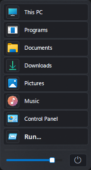

# ClassicStart

A lightweight, classic-style Start menu replacement for Windows — a single
self-contained C++ source file, no runtime dependencies beyond the OS.



## Features

- Classic single-column Start menu: This PC, Programs, Documents, Downloads,
  Pictures, Music, Control Panel, and Run, each with real Windows-accurate
  icons.
- A search/Run box that resolves typed commands, known folders, and
  installed apps (including packaged/Store apps).
- Power flyout with Restart, Shut down, Sign out, and Lock, each with a
  hover label.
- Up to 3 configurable quick-launch buttons.
- Live opacity slider, acrylic blur, rounded corners, and the real Windows
  accent color — all anti-aliased.
- Renders in Segoe UI Variable and Segoe Fluent Icons — the same fonts
  Windows 11's own Start menu and Settings app use — falling back to
  classic Segoe UI / Segoe MDL2 Assets on older Windows versions that
  don't have them installed.
- Full keyboard navigation (Tab / Shift+Tab / arrows) with a visible focus
  ring, and Ctrl+Esc to open.
- Single-instance: launching it again cleanly replaces any running copy.

## Building

Requires the MSVC Build Tools (Desktop development with C++) to be
installed. Then just run:

```
build.bat
```

This produces `classicstart.exe` in the same folder. No other files are
required at build time.

## Configuration

On first launch, ClassicStart writes a fully-commented `classicstart.ini`
next to the exe with default values, so there's always something present to
find and hand-edit — nothing to configure by trial and error. Delete the
file at any time to regenerate the defaults.

```ini
[Appearance]
Scale=0.85        ; overall UI scale, 0.3 - 2.0
StartOpacity=225  ; window opacity on open, 90 - 255

[QuickTools]
Tool1=            ; up to 3 pinned quick-launch buttons
Tool2=            ; one executable name per entry, e.g. calc.exe
Tool3=

[MenuItems]
ThisPC=1          ; every row ClassicStart can show, in order —
Programs=1        ; set any to 0 to hide that row. If every item
Documents=1       ; ends up disabled, all of them show anyway
Downloads=1       ; rather than leaving an empty menu.
Pictures=1
Music=1
ControlPanel=1
Run=1
```

`Scale`, `StartOpacity`, and `MenuItems` apply the next time the app
launches. `QuickTools` entries refresh live, every time the menu is opened.

## License

MIT — see [LICENSE](LICENSE).
